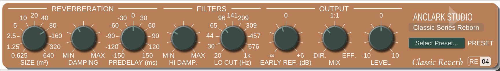

# Classic Reverb RE-04

Classic Reverb RE-04 is a reversed engineering of Kjaerhus Classic Reverb, a studio-quality free reverb plugin. It sounds professional, with a flavor of vintage reverb, suitable for many applications from vocals to instruments.

It has enhanced features and a modern interface, while still retaining the charm of the original plugin. This project is open-source and available for free, allowing users to enjoy the classic reverb sound on their modern DAWs and operating systems.



## Background

Classic Reverb was part of Classic Series by Kjaerhus Audio, a Danish company that developed audio plugins. The original plugin was released in the early 2000s and became popular for its high-quality sound and user-friendly interface. However, it was discontinued in early 2010s, leaving many users without access to this beloved reverb.

Several DAWs like Acoustica Mixcraft included Classic Reverb as a built-in plugin, but it was only available on Windows, and it only had a 32-bit VST2 version. Modern 64-bit-only DAWs and non-Windows users were left out of the fun.

Years later, in 2026, I (AnClark Liu) decided to reverse engineer the Classic Reverb to bring it back to life. The result is this open-source implementation that closely mimics the sound and behavior of the original plugin. Now it's available in a modern format, compatible with today's DAWs and operating systems.

## Features

- High-quality reverb algorithm that captures the essence of the original Classic Reverb.
- Bring back the original panel design and controls with modern technology.
- Multi-platform support, including Windows, macOS, and Linux.
- Multiple plugin formats, including VST 2.4, VST3, CLAP, LV2 and JACK standalone (optional).
- Advanced preset management system, allowing users to save and load their favorite reverb settings.
- Shipped with a collection of factory presets that cover common reverb styles.

## How to Compile

To compile the Classic Reverb RE-04 plugin, you will need to have the following dependencies installed:

- CMake (version 3.15 or higher)
- A C++ compiler that supports C++17 (e.g., GCC, Clang, MSVC)

1. Clone the repository:

   ```bash
   git clone --recurse-submodules https://github.com/AnClark/ClassicReverb-RE04.git
   cd ClassicReverb-RE04
   ```

2. Configure the build:

   ```bash
   cmake -S . -B build -DCMAKE_BUILD_TYPE=Release
   cmake --build build
   ```

3. The compiled plugin will be located in the `build/bin` directory.

## Build and Package Classic Reverb

Classic Reverb RE-04 uses CMake for building and CPack for packaging. The package format is selected automatically for the target platform:

- Windows and Linux: ZIP archive
- macOS: CPack Bundle DMG containing the plugin app bundles

To build and package directly with CMake:

```bash
cmake -S . -B build -DCMAKE_BUILD_TYPE=Release
cmake --build build --target package
```

The package is written to the `build` directory. The installed package contains the VST2, VST3, and CLAP plugin bundles.

### Cross-build for Windows on Linux / macOS

The `Makefile.win32_cross.mk` pipeline cross-compiles RE-04 for Windows and delegates packaging to CPack:

```
make -f Makefile.win32_cross.mk
```

The cross-build pipeline requires a MinGW-w64 C++ compiler, CMake, Ninja, CPack, ccache, Git, and sed.

## Tools used

- **Ghidra**: For disassembling and decompiling the original plugin's binary to understand its inner workings and behavior.
- **IDR**: Classic Series were written in Delphi. IDR was used for generating IDC script for recovering Delphi-specific symbols and structures (e.g. `ASCIIString`).
- **Dhrake**: For applying the generated IDC script to the Ghidra project, which helps in understanding the code structure and logic. (You can see Dhrake as a "demangler" for Ghidra, which marks up the Delphi-specific stuffs in a more readable way.)
- **Claude Sonnet 4.6**: For researching the decompiled code, and for assisting in the development process.

## DISCLAIMER

This project is a reverse engineering effort and is not affiliated with Kjaerhus Audio or any of its former employees. The original Classic Reverb plugin was developed by Kjaerhus Audio, and this implementation is an independent recreation based on the original's behavior and sound.

This project is not affliated with Acoustica LLC, and other manufacturers that included Classic Reverb in their products.

The Kjaerhus logo in the plugin UI is used under fair use for non-commercial purposes, to describe where the original Classic Reverb plugin came from.

## License

This project is licensed under the GPLv3 License. See the [LICENSE](LICENSE) file for details.

Components in `widgets/imgui-ext` and `widgets/imgui-knobs-mod` are licensed under the MIT License, while `widgets/dpf-imgui` is licensed under the ISC License. See the respective LICENSE files in those directories for details.
